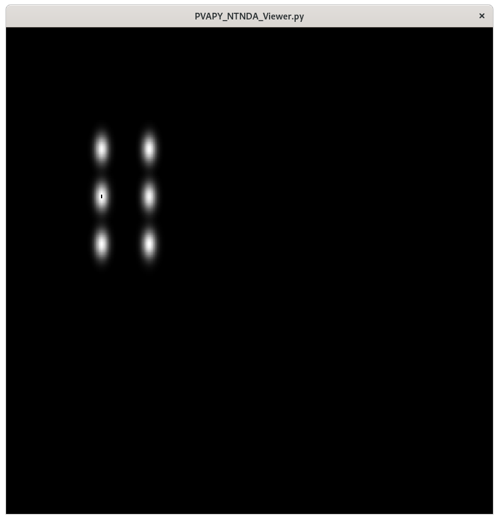
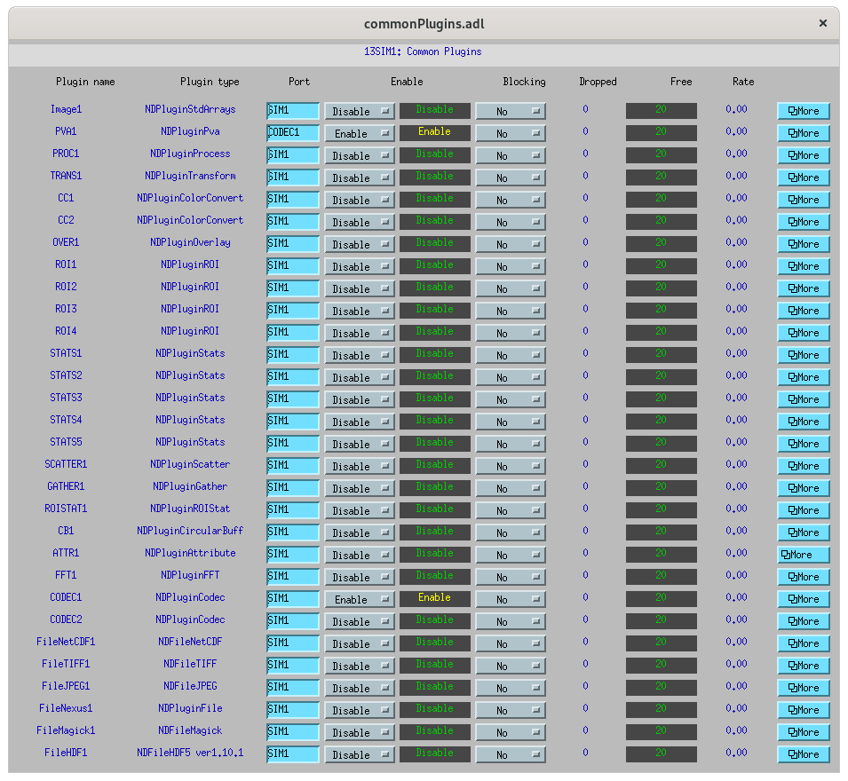
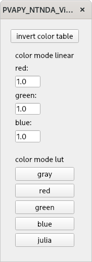
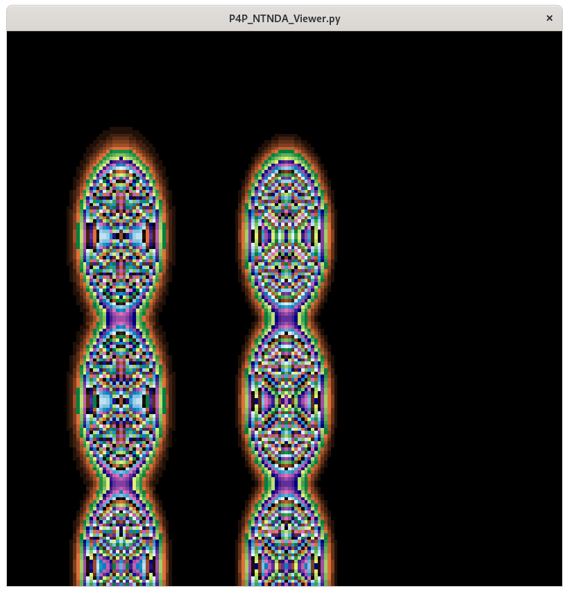

# PY_NTNDA_Viewer

Author: Marty Kraimer
Date: 2020.09.02

## Overview

PY_NTNDA_Viewer is Python code that is similar to the Java EPICS_NTNDA_Viewer that comes with areaDetector.

It is available in [ADViewers](https://github.com/areaDetector/ADViewers)

It is a viewer for images obtained from an areaDetector pvAccess channel that provides an NTNDArray.

There are currently 2 versions:

1. P4P_NTNDA_Viewer.py This uses p4p.
2. PVAPY_NTNDA_Viewer.py This uses pvaPy.

Both are supported on Windows, Mac OSX, and Linux.

## Required Python Modules

You must have python and pip installed.

The other python modules can be installed via pip install …

For example issue the command:

    sudo pip install numpy

The following is a list of modules required by PY_NTNDA_Viewer

    numpy
    PyQt5
    PyQt5-sip
    QtPy
    p4p and/or pvapy

## User Interface

When either version is started the following control window appears:

When start is pressed the following appears:

### First row of control window

- **start** Clicking this button starts communication with the server
- **stop** Clicking this button stops communication with the server
- **showInfo** Clicking this brings up the showInfo window. See below for details.
- **showColorTable** Clicking this brings up the ColorTable window. See below for details
- **channelName** This is the name of the channel that provides the NTNDArray. When in stopped mode a new channel name can be specified.

### Second row of control window

- **imageRate** This shows the number of images/second that are being displayed. Note that this is normally less than the number of images the server is producing.imageRate.
- **imageSize** This specifies the size of the image window; both width and height
- **compressRatio** If image is compressed this shows the compression ratio.
- **codec** The compression type. **none** means no compression.
- **clear** Clear the following status label.

### Third row of control window

- **autoScale** image pixel values are scaled.
- **manualScale** image pixel values are scaled via manualMin and manualMax
- **manualMin** minimum value for manual scaling.
- **manualMax** maximuum value for manual scaling.
- **resetZoom** revert to full image.
- **zoomIn** zoom into the current image.
- **x1,...,x16** scale factor for zoomIn as multiple of 1.0/256.0
- **zoomBack** revent to previous zoom.

## Starting the example

### Starting simDetector

Start an IOC running the simDetector. For example I start it as follows:

    mrk> pwd
    /home/epics7/areaDetector/ADSimDetector/iocs/simDetectorIOC/iocBoot/iocSimDetector
    mrk> ./start_epics

### Start a display manager

At least the following choices are available: medm, edm, pydm, and css. For any choice the display file, with name simDetector, to load is located in areaDetector/ADSimDetector/simDetectorApp/op

For example to use medm I have the files setEnv and startSimDetector, which are:

    export PATH=$PATH:/home/epics7/extensions/bin/${EPICS_HOST_ARCH}
    export EPICS_DISPLAY_PATH=/home/epics7/areaDetector/ADCore/ADApp/op/adl
    export EPICS_DISPLAY_PATH=${EPICS_DISPLAY_PATH}:/home/epics7/areaDetector/pvaDriver/pvaDriverApp/op/adl
    export EPICS_DISPLAY_PATH=${EPICS_DISPLAY_PATH}:/home/epics7/areaDetector/ADSimDetector/simDetectorApp/op/adl
    export EPICS_CA_MAX_ARRAY_BYTES=40000000

and:
    source ./setEnv
    medm  -x -macro "P=13SIM1:,R=cam1:" simDetector.adl

then I just enter:

    ./startSimDetector

### start P4P_NTNDA_Viewer or PVAPY_NTNDA_Viewer

The channelName can be specified in three ways:

1. Via environment variable EPICS_NTNDA_VIEWER_CHANNELNAME.
2. As a command line argument.
3. By entering it via the viewer when in stop mode.

In order to use the codec support from **areaDetector** you must have a path to
**areaDetector/ADSupport/lib…** defined.
The details differ between Windows and Linux or MacOSX.

An example is **exampleStartP4P**, which uses **p4p** for communication with the simDetector:

    export LD_LIBRARY_PATH=$LD_LIBRARY_PATH:/home/epics7/areaDetector/ADSupport/lib/linux-x86_64
    export EPICS_NTNDA_VIEWER_CHANNELNAME="13SIM1:Pva1:Image"
    python P4P_NTNDA_Viewer.py

I start it via:

    mrk> pwd
    /home/epics7/modules/PY_NTNDA_Viewer
    mrk> ./exampleStartP4P
    
You will see errors if You have not installed all the python packages required. If it shows no errors click connect and start.

Then:

1. Run whatever opi tool you use to control the simDetector. Details provided in next section
2. Click start.

You should see images being displayed.

**exampleStartPVAPY** starts **PVAPY_NTNDA_Viewer.py**, which uses **pvapy** for communication with the simDetector.

    
## Suggested simDetector setup

### Main window

The following is the main window for the simDetector:

The following are the controls of interest:

1. **All Plugins** This brings up the commonPlugin described below.
2. **Simulation setup** This brings up simDetectorSetup described below.
3. **Image mode** Usually set to continuous.
4. **start** and **stop** start and stop acquisition
4. **Data Type** All data types work. For other than uint8 you may also want to adjust gain.
5. **ColorMode** All work
6. **Gain** Suggestions are 1 for simulation mode linarRamp and 255 for simulation mode peaks.

### commonPlugins

The following are the ones of interest.

1. **PVA1** Must be enabled. Set Port to **CODEC1** if you want to use **CODECs**
2. **CODEC1** If you want to use codecs click on the More botton on right side of window.

### NDCodec

This is the controller for **CODEC1**.
The controls of interest are:

1. **Enable** It must be set to enable.
2. **Compressor** Select the codec support you want.
3. **Bloscc Compressor** If Compressor is **Blosc** this selects type.

### Simulation Setup

This show setup options.
The options shown are the ones for the examples shown in this document.

## Image Zoom

The following are the ways to change the part of the image that is displayed.

1. **mouse** Use the mouse to select a subimage of the current image. That is press, drag, and release.
2. **zoomIn** Clicking zooms in. x1, ..., x16 sets zoom amount as multiple of 1/256.
3. **zoomBack** Clicking reverts to previous zoom image
4. **resetZoom** Reverts to full image.

## showInfo

This show information about current image.
The mouseClick information updates when the mouse is clicked in the image window.

## Color Table

This provides psudo color maps for mono images.

Note that when peak mode is being used julia color comes close to showing the actual edges
of the peaks.

For example if julia is selected and the image is zoomed, I see:

Then issue mouse clicks in the image and look at showInfo to see how mouse values change.

